# IPO新股认购Node.js迁移

## 需求背景
目前futu5项目过于庞大，高频的发布可能会造成服务不稳定，项目耦合度高。

现在引入`Node.js`作为前端机接入层，解藕服务，增强服务的稳定性，以及发布带来的影响。

## 整体架构
现有的架构图：

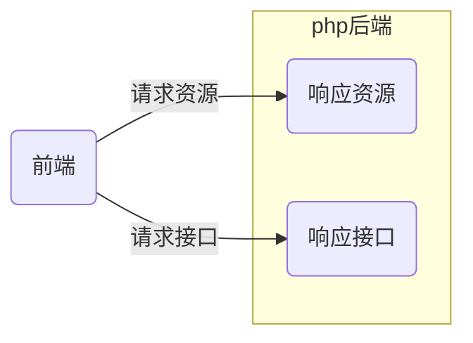

改造后的架构图：

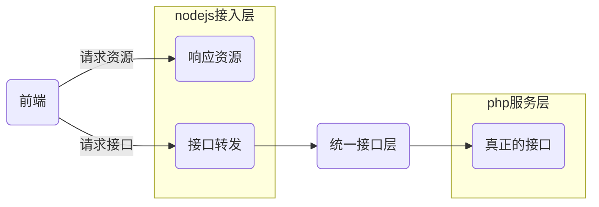

通过接入`Node.js` , `php`专注于后端服务，`Node.js`专注于前端服务。 

## 需求要点
通过`Node.js`搭建整个ipo新股认购的前端系统，部署上线运营。
### 前端部分
1. 迁移列表页面，认购页面，历史记录页面，详情页
2. 多语言支持
3. 页面公共模版文件引入
4. 日志上报
5. 广告接入
6. 公告接入
7. 前端渲染模式
8. 前端数据格式
9. 组件使用
10. 前端构建工程化
11. 静态文件的存放
12. 前端框架选择

### Node.js部分
1. redis服务接入
2. 与ipo服务通信的方式（http/s || srpc）
3. 基础服务的接入（开户，活动，入金，账户信息，消息接入）
4. 客服系统接入
5. 权限校验
6. 日志上报
7. 后端返回数据格式
8. 错误码定义
9. 白名单机制
10. 异常情况处理
11. 域名验票
12. 跨域请求
13. 测试用例
14. 性能测试
15. 权限申请
16. 接入统一层
17. 接口超时控制
18. 交易密码验证
19. IE 浏览器对 application/json 返回会处理成下载，故换成 text/html

### 发布/部署
1. 机器申请
2. 机器初始化
3. 基础组件安装(nginx ,uls,attr,node ,pm2)
4. 发布系统配置
5. 测试环境部署
6. 预发布验证
7. 正式环境发布

### 运维
1. 服务监控
2. 高并发
3. 服务高可用
4. 容灾方案
5. 健康检查

### 统计分析
1. 数据统计分析
2. 性能分析

### 安全
1. 攻击防御
2. 异常监控

### 迁移
1. 迁移前置依赖
2. 迁移节奏
3. 灰度节奏 

## 服务依赖
ipo接入层，除了依赖ipo服务外，还会依赖很多的底层基础服务。

1. 消息服务
2. 客服中心
3. 登陆服务
4. 账户服务
5. 交易密码服务
6. 开户服务
7. IPO服务
8. 资金服务

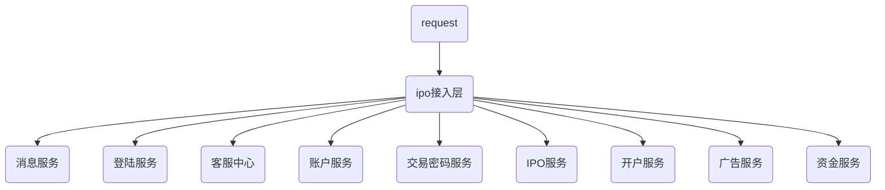

## 技术选型
### 前端
保留原ipo的所有页面逻辑。

1. 前端框架： Vue 2+
2. 是否是单页面： 是
3. 前端路由： hash模式
4. 兼容性： ie9+

### 前端工程化
1. 打包编译：webpack 4+
2. 语法转换：babel 7+
3. 工作流处理： gulp 3+
4. 自动化构建：gitlab-ci

### Node.js接入层
1. 接入层框架：[koa2](https://github.com/koajs/koa)
2. 接入层路由：[koa-router](https://github.com/alexmingoia/koa-router)

### 使用已有中间件

富途中间件：

|富途中间件|作用|
|---|---|
|[@futu/monitor](http://gitlab.futunn.com/nodepackage/monitor)|Monitor 系统上报|
|[@futu/node-uls](http://gitlab.futunn.com/nodepackage/node-uls)|uls 日志记录上传|
|[@futu/node-cmlb](http://gitlab.futunn.com/nodepackage/node-cmlb)|获取服务 ip 与端口|
|[@futu/httpclient](http://gitlab.futunn.com/nodepackage/httpclient)|调用 web 服务|

依赖中间件：

|依赖中间件|作用|
|---|---|
|[koa-logger](https://github.com/koajs/logger)|请求/响应的日志记录（状态码，耗时，大小）|
|[koa-ejs](https://github.com/koajs/ejs)|渲染响应 `ejs` 模板文件，供 `Nodejs` 吐出数据|
|[koa-body](https://github.com/dlau/koa-body)|解析请求体|
|[koa-static](https://github.com/koajs/static)|静态文件服务|
|[koa-router](https://github.com/alexmingoia/koa-router)|提供路由功能|
|[koa-useragent](https://github.com/rvboris/koa-useragent)|解析 UA 信息|


## Node.js对外接口协议

### 获取购买力数据
#### 功能说明
获取用户当前账户的购买力。

#### 请求方式
| 方式 | url |
|---|---|---|---|
| get | https://my.futu5.com/ipo/api/getAssetPower |

#### Get请求参数说明
| 参数名 | 参数描述 | 类型 | 必填 |
|---|---|---|---|
| version | 使用接口的版本 | float | 是 |
| accountId | 使用的账户Id | int | 是 |
| stockId | 认购新股股票id | int | 是 |
| onlyUseCash | 只使用可提现金认购 | int | 否 |
| zeroAsset | 是否为0本金认购 | int | 否 |


#### 返回参数说明

| 参数名 | 参数描述 | 类型 |
|---|---|---|---|
| code | 请求成功后，返回数据状态码 | int |
| data | 数据 | Object |
| message | 消息 | String |


### 提交认购
#### 功能说明
提交用户认购

#### 请求方式
| 方式 | url |
|---|---|---|---|
| post | https://my.futu5.com/ipo/api/applyTask |

#### post请求参数说明
| 参数名 | 参数描述 | 类型 | 必填 |
|---|---|---|---|
| version | 使用接口的版本 | float | 是 |
| tradePassword | 交易密码md5 | string | 是 |
| buyCount | 认购数量 | int | 是 |
| buyAmount | 认购金额  | int | 是 |
| accountId | 账户ID  | int | 是 |
| cashPart |  使用现金部分  | int | 是 |
| assetMargin | 使用账户融资部分  | int | 是 |
| isMarginIpo | 是否为融资认购 0现金认购，1融资认购  | int | 是 |
| channel | 渠道号  | string | 是 |
| taskId | 0新建认购 非0修改认购  | int | 是 |
| zeroAsset | 是否为0本金认购 1是 0否  | int | 是 |


#### 返回参数说明

| 参数名 | 参数描述 | 类型 |
|---|---|---|---|
| code | 请求成功后，返回数据状态码 | int |
| data | 数据 | Object |
| message | 消息 | String |

### 撤销认购
#### 功能说明
撤销用户的认购

#### 请求方式
| 方式 | url |
|---|---|---|---|
| post | https://my.futu5.com/ipo/api/cancelTask |

#### post请求参数说明
| 参数名 | 参数描述 | 类型 | 必填 |
|---|---|---|---|
| version | 使用接口的版本 | float | 是 |
| taskId | 任务id | int | 是 |


#### 返回参数说明

| 参数名 | 参数描述 | 类型 |
|---|---|---|---|
| code | 请求成功后，返回数据状态码 | int |
| data | 数据 | Object |
| message | 消息 | String |


## 交互逻辑流程图

### 接口层调用流程图

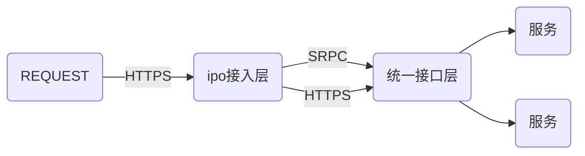


### 统一登陆流程图

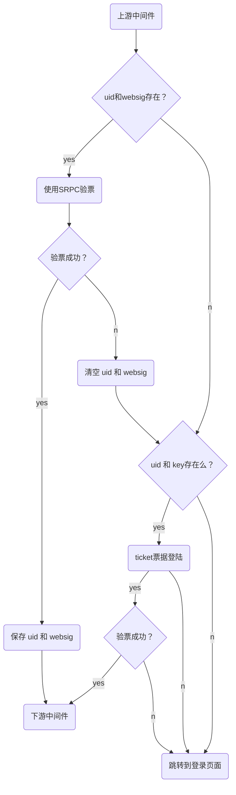

### 认购列表模块流程图

Node.js接入层：

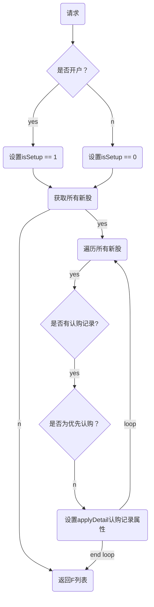

前端列表页面：
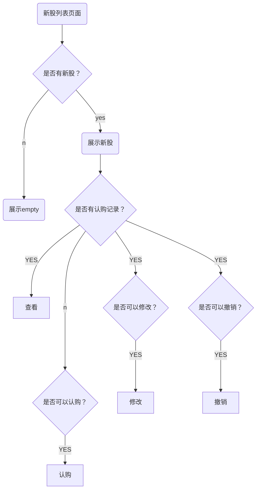


### 认购申请模块流程图

Node.js接入层：

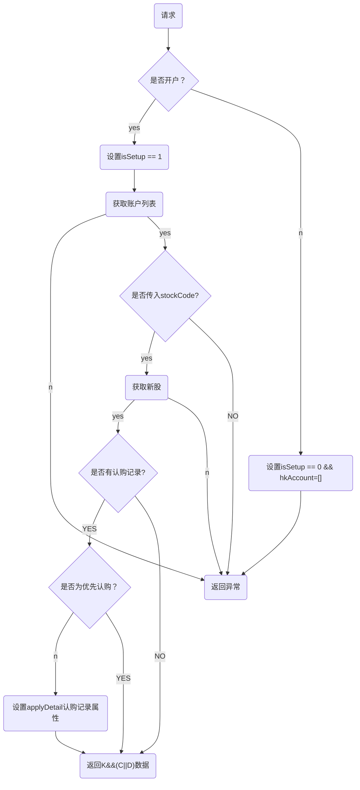

前端认购页面：

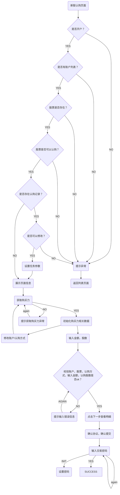

Node.js 认购任务提交逻辑流程图：

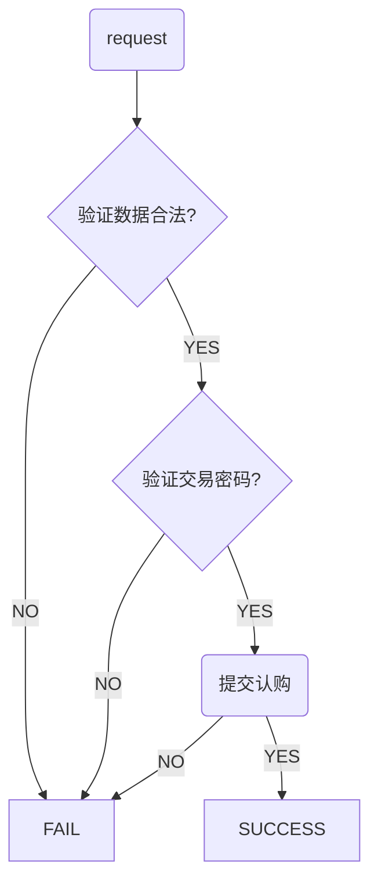


### 认购历史记录流程图

Node.js接入层


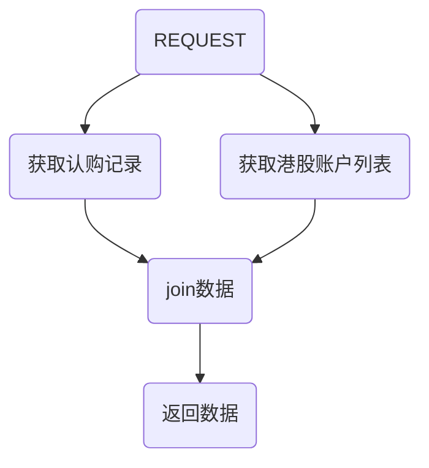


前端历史记录页面：
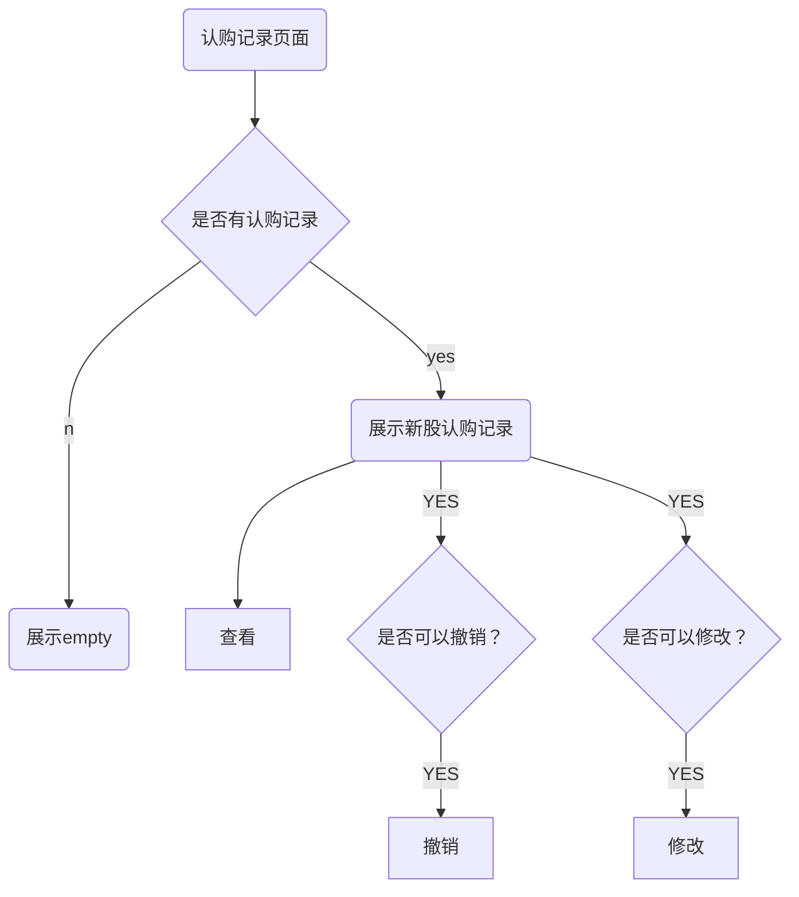

### 认购详情流程图

Node.js接入层


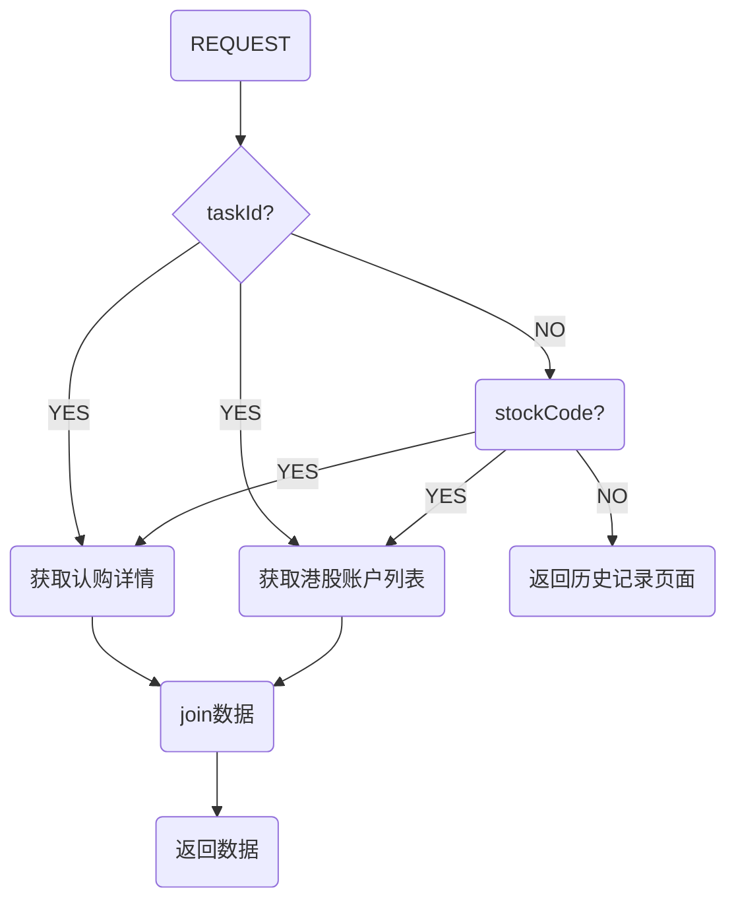

前端认购详情页面：
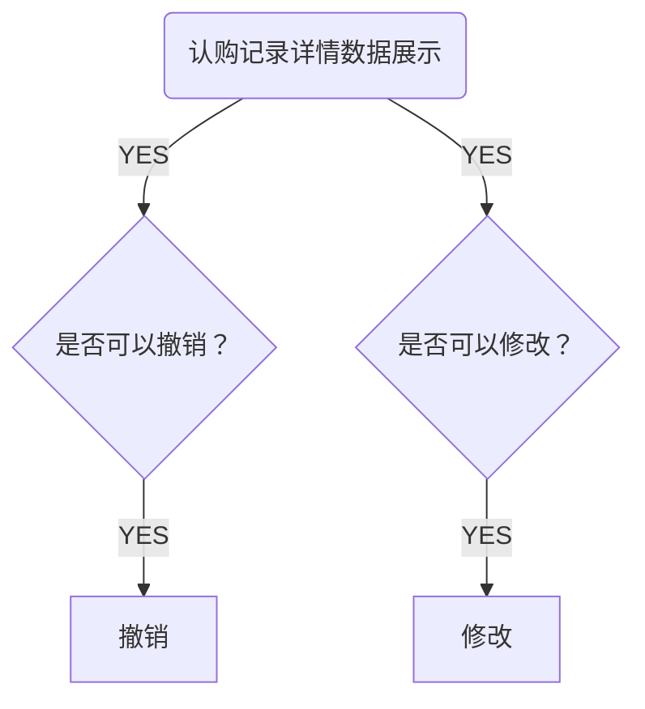

## 代码分层架构
前端主要使用Vue 2+ , 后端主要使用Node.js Koa2+框架。

前端按照每个页面一个目录的形式存放，方便代码管理。

后端接入层，按照正常的mvc模式。

```txt
.
├── .eslintrc.js                            //eslint配置文件
├── .gitignore                  
├── .npmrc
├── client                                 //前端源码目录
│   ├── components                              //vue组件
│   │   └── list
│   │       └── index.vue
│   ├── entries                                //vue入口文件
│   │   └── list.js
│   ├── scss                                   //scss样式文件
│   │   └── list.scss
│   ├── utils                                  //工具目录
│   │   └── format-number
│   │       └── index.js
│   └── views                                  //webpack构建模板文件目录
│       └── list.html
├── common                                // 公共部分
│   └── domain.js                              //域名配置文件
├── cossyncconf.json                      // cos上传配置
├── doc                                   // 文档
│   └── ipo.md
├── package-lock.json               
├── package.json
├── pm2.prod.config.js                   //pm2 配置
├── pm2.test.config.js
├── postcss.config.js                    //postcss配置
├── readme.md     
├── server                              //服务端代码
│   ├── config                               //服务配置
│   │   ├── development.js                          //开发
│   │   ├── index.js
│   │   ├── test.js                                 //测试
│   │   └── production.js                           //正式
│   ├── controllers                          //控制器
│   │   ├── accountController.js
│   │   └── siteController.js
│   ├── enums                               //静态变量
│   │   └── status.js
│   ├── index.js                            //服务启动文件
│   ├── lib                                 // 库文件
│   │   ├── JsonResponse.js
│   │   └── ServerRequest.js
│   ├── locales                             //多语言
│   │   ├── en-us.js
│   │   ├── zh-cn.js
│   │   └── zh-hk.js
│   ├── middleware                          //中间件
│   │   └── index.js
│   ├── routers                            //路由控制
│   │   ├── api.js
│   │   ├── index.js
│   │   └── render.js
│   ├── services                           //服务请求
│   │   └── accountService.js
│   ├── utils                              //工具
│   │   └── redisStore.js
│   ├── views                              //模板，一般由webpack构建生成 
│   │   └── list.html
│   └── watcher.js                         //服务时时更新
├── static                          // 静态文件目录
│   ├── dist
│   │   ├── list.css
│   │   ├── list.js
│   │   └── vue.js
│   └── images
│       └── favicon.ico
└── webpack.config.js              // webpack配置
```


## 估计时间
1. 因为页面上下左边，都需要和其他页面使用统一模版，但是由于不是同一代码库，需要将公共部分做成模版，需要研究引入方式。
2. 由于公共模块里面有很多服务，所以需要做 基础服务接入研究。
3. 页面渲染方式尝试做前后端同构。

| 页面/模块 | 重构 | UI处理（交互） | 接口对接联调 | 错误和异常处理 | 自测 | 总计 |
|---|---|---|---|---|---|---|
|列表页面| 0.5 |0 |0.2|0.2|0.1|1|
|认购页面| 1 |0|0.2|0.2|0.1|1.5|
|历史记录页面| 0.5 |0|0.2|0.2|0.1|1|
|认购详情页面| 0.5 |0|0.2|0.2|0.1|1|
|列表功能| 0 |0.5 |0.2|0.2|0.1|1|
|认购功能| 0 |1|0.2|0.2|0.1|1.5|
|历史记录功能| 0 |0.3|0.2|0.2|0.1|0.8|
|认购详情功能| 0 |0.3|0.2|0.2|0.1|0.8|
|公共模版页面预研| 2 |0|0|0|0|2|
|公共模版页面| 2 |0|0|0|0|2|
|前端框架搭建| 2 |0|0|0|0|2|
|前后端同构研究| 1 |0|0|0|0|1|
|Node.js框架搭建| 1.5 |0|0|0|0.5|2|
|登陆接入| 1 |0|0|0|0.5|1.5|
|统一接口层权限对接接入| 0.5 |0|0|0|0.5|1|
|公共模块预研| 2 |0|0|0|0|2|
|基础服务接入研究| 3 | 0|0|0|0|3|
|后端服务接入| 1 |0|0|0|0.5|1.5|
|列表接口| 0.2 |0|0|0|0.3|0.5|
|认购接口| 0.3 |0|0|0|0.2|0.5|
|购买力接口| 0.2 |0|0|0|0.3|0.5|
|撤销接口| 0.2 |0|0|0|0.3|0.5|
|moniter + uls| 1 |0|0|0|0|1|
|广告接入| 1 |0|0|0|0|1|
|客服接入| 1 |0|0|0|0|1|
|交易密码接入| 1 |0|0|0|0|1|
|账户服务接入| 1 |0|0|0|0|1|
|资金服务接入| 1 |0|0|0|0|1|
|多语言支持| 1 |0|0|0|0|1|
|白名单机制| 1 |0|0|0|0|1|
|接口超时| 0.5 |0|0|0|0|0.5|
|测试 + 优化 | 3 |0|0|0|0|3|
|打包测试 | 0.5 |0|0|0|0|0.5|

## 前端代码打包方案
使用ES6开发，babel编译到es5，webpack打包，包括CSS和图片文件也由webpack一并打包。

## 资源缓存处理方案
webpack打包时根据文件内容hash生成文件名，不同版本的文件名不一样。

## CSS打包方案
webpack一并打包。

## 运维
使用pm2.

## 迁移
可以一次迁移一个页面。

### 灰度
通过白名单机制，将白名单内的用户使用新服务。
